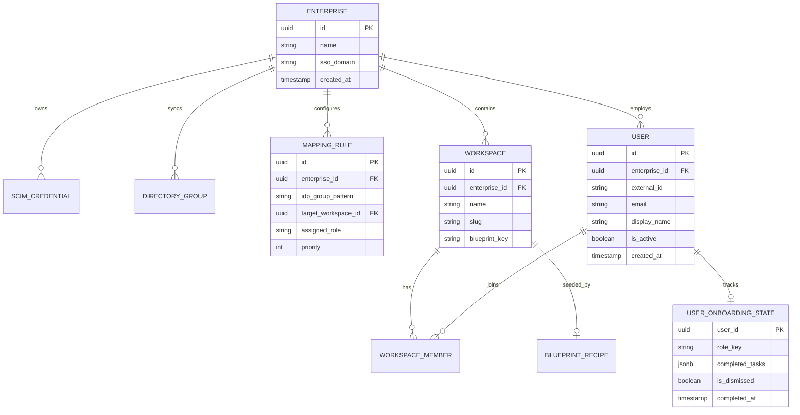

# Product Requirements Document (PRD)
## SCIM-Driven Role-Adaptive Workspace Provisioning

* **Status:** Draft (Synthesized via `/eg-prd`)
* **Workflow Reference:** [`.agent/workflows/eg-prd.md`](file:///c:/Users/chookie/Antigravity_project1/.agent/workflows/eg-prd.md)
* **Architecture Standard:** [`product/specs/template/agent.md`](file:///c:/Users/chookie/Antigravity_project1/product/specs/template/agent.md)
* **Date:** 2026-09-10

---

## 1. Executive Summary & Target User

### 1.1 Executive Summary
Enterprise teams adopting collaborative platforms routinely face friction: IT administrators are overwhelmed by manual account provisioning, and new enterprise users arrive into empty, generic environments with no team context ("blank canvas paralysis").

**SCIM-Driven Role-Adaptive Workspace Provisioning** creates a completely automated Day-0 onboarding path. By implementing native RFC 7643/7644 SCIM 2.0 endpoints, directory groups (from Okta, Microsoft Entra ID, Google Workspace) automatically provision users, assign fine-grained workspace roles, and seed pre-populated team workspaces using declarative recipe manifests. When users log in via SSO for the first time, a non-blocking 60-second role micro-runbook guides them through their first high-impact actions, driving immediate time-to-value (TTV) with zero IT intervention.

### 1.2 Target Personas
* **Enterprise IT Administrator (Sarah):** Needs automated user lifecycle management (JIT creation, role assignment, and instant de-provisioning) adhering to SOC2/ISO27001 audit standards without creating support tickets.
* **Team / Department Lead (Marcus):** Needs incoming engineers, PMs, or analysts to instantly land in a configured team space with existing starter projects, guidelines, and access permissions.
* **Enterprise End User (Alex):** Wants to sign in via company SSO and immediately see their team's assets, starter boards, and clear next steps rather than a generic product tour or an empty screen.

---

## 2. Codebase Grounding & Baseline Architecture

### 2.1 Current Repository Context
* **Current State:** Greenfield architecture establishing product specification standards and agentic protocols ([`agent.md`](file:///c:/Users/chookie/Antigravity_project1/product/specs/template/agent.md)).
* **Conventions & Invariants:**
  * Strict adherence to the Elephant / Goldfish review pattern before code generation.
  * Modular service separation between identity ingestion, mapping rules, asset seeding, and frontend components.

### 2.2 Target Implementation Structure
```
Antigravity_project1/
├── product/
│   └── specs/
│       ├── template/agent.md
│       └── scim-role-adaptive-onboarding-prd.md
├── src/
│   ├── api/
│   │   └── scim/v2/                 # RFC 7644 REST controller endpoints
│   │       ├── users.controller.ts
│   │       ├── groups.controller.ts
│   │       └── config.controller.ts
│   ├── services/
│   │   ├── scim/                    # SCIM parsing, token auth, filter evaluation
│   │   ├── provisioning/            # Rule matrix matcher & account lifecycle
│   │   └── blueprints/              # Recipe manifest parser & asset seeder
│   ├── blueprints/
│   │   └── recipes/                 # Declarative YAML/JSON starter recipes
│   │       ├── engineering.json
│   │       ├── product.json
│   │       └── default-general.json
│   └── web/
│       └── components/
│           └── onboarding/          # Non-blocking micro-runbook banner & telemetry
```

---

## 3. In-Scope vs. Out-of-Scope

### 3.1 In-Scope (Phase 1)
* **Native SCIM 2.0 REST Endpoints:** Full compliance with RFC 7643 and RFC 7644 for `/scim/v2/Users`, `/scim/v2/Groups`, `/scim/v2/ServiceProviderConfig`, and `/scim/v2/ResourceTypes`.
* **Tenant SCIM Bearer Authentication:** Secure, rotatable API tokens per enterprise organization.
* **Asynchronous Ingestion Worker Queue:** Fast HTTP acknowledgement (<300ms) with background event idempotency.
* **Declarative Role & Workspace Mapping Engine:** Tenant-configurable rule matrix evaluating IdP directory groups to target workspace slugs and roles, with fallback defaults.
* **Declarative Blueprint Recipe Manifests:** Role-specific JSON/YAML templates that automatically seed starter boards, pinned queries, and sample datasets into new workspaces.
* **Context-Aware Micro-Runbook Banner:** Non-blocking, dismissible Day-0 banner providing a 3-step role-specific checklist with real-time completion tracking.
* **Audit Trail & De-provisioning:** Comprehensive event logging and instantaneous workspace lock/revocation upon SCIM `active: false` or user deletion.

### 3.2 Out-of-Scope
* Custom on-premise LDAP agent syncing (organizations must bridge via Okta / Entra SCIM bridges).
* Custom vanity subdomains (e.g., `acme.platform.com`)—handled in a separate domain-routing PRD.
* Enterprise contract billing meters and seat purchasing flows (handled by enterprise sales CRM/Stripe).

---

## 4. Functional & Technical Requirements

### 4.1 Functional Requirements

#### FR-1: SCIM 2.0 Ingestion Endpoints (RFC 7644)
* **FR-1.1 Service Discovery:** Expose `GET /api/v1/scim/v2/ServiceProviderConfig` indicating support for `PATCH`, `filter` (maxResults: 100), `bulk: false`, and `changePassword: false`.
* **FR-1.2 User Lifecycle:**
  * `POST /api/v1/scim/v2/Users`: Create user account, assign email, and stage for workspace placement.
  * `GET /api/v1/scim/v2/Users`: Support filtering by `userName eq "user@example.com"` and pagination (`startIndex`, `count`).
  * `GET /api/v1/scim/v2/Users/{id}`: Return user representation in SCIM 2.0 JSON format.
  * `PATCH /api/v1/scim/v2/Users/{id}`: Update specific attributes (e.g., `active: false`, name, emails).
  * `DELETE /api/v1/scim/v2/Users/{id}`: Soft-delete/deactivate user account and terminate active sessions.
* **FR-1.3 Group Lifecycle:**
  * `POST /api/v1/scim/v2/Groups`: Ingest directory group and member references.
  * `PATCH /api/v1/scim/v2/Groups/{id}`: Handle `add`, `remove`, and `replace` member operations.

#### FR-2: Declarative Mapping Matrix
* **FR-2.1 Rule Definition:** Support ordered rules matching IdP group names to target workspace and role:
  * Example: Group `eng-frontend` -> Workspace `Frontend Team`, Role `Developer`.
* **FR-2.2 Conflict Resolution:** When a user belongs to multiple mapped groups, grant multi-workspace access, setting their primary default workspace to the highest-priority rule match.
* **FR-2.3 Fallback Default:** Users with no matching directory groups are automatically added to the organization's designated `General Workspace` with `Viewer` or `Member` role.

#### FR-3: Blueprint Recipe Manifest Seeding
* **FR-3.1 Blueprint Ingestion:** Declarative JSON/YAML recipes defining initial workspace state:
  * Starter boards/projects
  * Pinned team documentation links
  * Sample query/data cards
* **FR-3.2 Idempotent Materialization:** When a new workspace is instantiated via SCIM, the blueprint seeder executes as a transaction, guaranteeing that partial failures roll back cleanly.

#### FR-4: First-Session Micro-Runbook Banner
* **FR-4.1 Non-Blocking Presentation:** Displayed at the top of the workspace on first login; does not block workspace navigation or lock the interface.
* **FR-4.2 Role-Adaptive Steps:**
  * *Developer:* 1. Clone repository / Connect Git; 2. Run first sandbox query; 3. Join team channel.
  * *Product Manager:* 1. Review team roadmap; 2. Create first spec draft; 3. Invite cross-functional reviewer.
  * *Admin:* 1. Verify SCIM sync status; 2. Confirm security audit log stream; 3. Review active seat count.
* **FR-4.3 Persistence:** Users can minimize, dismiss, or complete the checklist; state is tracked in `user_onboarding_states`.

---

### 4.2 Data Models & Schema Design



---

## 5. Research Sweeps (Pass 2 Findings)

### 5.1 Market Standards & Prior Art
* **Okta / Entra SCIM Requirements:** IdPs expect `PATCH` operations conforming to RFC 7644 Section 3.5.2 with `add`, `remove`, and `replace` path syntax. Fast response headers (<300ms) with `204 No Content` or `200 OK` prevent IdP timeout retries.
* **Linear / Slack Enterprise Grid Patterns:** Users should never be stuck waiting for provisioning locks. If an SSO login occurs before SCIM sync catches up, JIT provisioning acts as an immediate forward-link, which the SCIM queue later reconciles.

### 5.2 Technical & State Patterns
* **Event Idempotency:** The SCIM worker uses an idempotency key `hash(tenant_id + scim_resource_id + version)` in Redis to discard duplicated webhook/HTTP bursts.
* **De-provisioning Cascade:** Setting `active: false` must:
  1. Invalidate all active JWT tokens and sessions.
  2. Revoke active API tokens created by the user.
  3. Mark `workspace_members.is_active = false` while preserving their historical attribution (comments, commits, created assets).

### 5.3 UX & Edge Cases
* **Existing Email Collision:** If a user already signed up with work email `alex@acme.com` prior to enterprise SCIM enablement, trigger an account claim email with an SSO verification prompt rather than throwing a raw 409 error.
* **IdP Group Rename:** When an IdP group changes name (e.g. `eng-core` to `eng-platform`), SCIM sends a `PATCH` to the Group entity. The mapping engine must re-evaluate rules dynamically without unseating users.
* **Rate Limiting:** Provide HTTP 429 with standard `Retry-After: 30` header when initial bulk directory synchronization exceeds 50 requests/sec.

---

## 6. Success Metrics & Telemetry

| Metric | Target | Telemetry Event / Source |
| :--- | :--- | :--- |
| **Time-to-First-Value (TTFV)** | < 90 seconds from first SSO login | `onboarding.first_key_action_completed` |
| **IT Provisioning Overhead** | 0 manual IT tickets required | Customer support ticket categorization |
| **Micro-Runbook Engagement** | > 65% completion rate of 3 micro-actions | `runbook.step_completed`, `runbook.finished` |
| **SCIM Ingestion Reliability** | 99.95% event success rate; <1s sync lag | Worker queue processing metrics |
| **Day-14 Active Cohort** | > 80% weekly active usage | Product analytics retention funnel |

---

## 7. Explicit Open Questions & Future Spikes

1. **SCIM Group Nesting:** Should nested IdP directory groups (e.g., `department-eng` contains `team-ui`) automatically inherit parent workspace permissions, or should mapping only evaluate leaf groups? *(Recommended for Phase 1: Leaf-level group mapping only).*
2. **Template Data Cleanup:** Should sample data injected by the blueprint recipe automatically purge after 30 days if unused, or remain permanently until manually deleted? *(To be reviewed during implementation planning).*
3. **Cross-Tenant SCIM Federation:** Do multi-national enterprise accounts require separate SCIM endpoints per subsidiary domain, or a single centralized corporate tenant? *(Phase 1 assumes single tenant per enterprise ID).*
